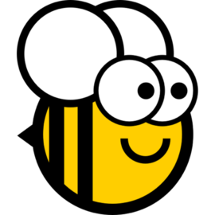

{ width=100 .tutorial-logo }

## New to BeeWare? { .tutorial-text }

[Take the tutorial](https://tutorial.beeware.org){ .tutorial-button }

# Featured tools { .featured-tools }

{ .featured-logo }

## [Toga](https://toga.beeware.org) { .featured-name }

A Python native, OS native GUI toolkit.

{ .featured-logo }

## [Briefcase](https://briefcase.beeware.org) { .featured-name }

Convert a Python project into a standalone native application.

# Other tools { .other-tools }

Utilities used by and applications built with BeeWare tools.

### Showcased applications

Applications maintained by the BeeWare team that are built using BeeWare's tools.

{ .other-tools-logo }

#### [Podium](https://podium.beeware.org) { .podium-name }

A markup-based slide presentation tool.

### Utilities

Pieces used by other BeeWare tools that can be useful on their own.

{ .other-tools-logo }

#### [Rubicon Objective-C](https://rubicon.beeware.org) { .rubicon-name }

A library for bridging between Python and the Objective-C language runtimes.

{ .other-tools-logo }

#### [Python Apple Support](https://python-apple-support.beeware.org) { .python-apple-name }

A meta-package for building a version of Python that can be embedded into a macOS, iOS, tvOS or watchOS project.

{ .other-tools-logo }

#### [Chaquopy](https://chaquo.com/chaquopy/) { .chaquopy-name }

A meta-package for building a version of Python that can be embedded into a macOS, iOS, tvOS or watchOS project.

# BeeWare project details { .details }

BeeWare is more than a suite of tools for building amazing apps. It's also an amazing community! Learn about how we keep our community safe and welcoming, how to contribute to BeeWare, and more about the philosophy behind the project.

## BeeWare Community Code of Conduct

Everyone participating in the BeeWare community, in any way, is required to adhere to the guidelines in the [BeeWare Community Code of Conduct](https://beeware.org/community/behavior/code-of-conduct). Please familiarize yourself with it, and follow the guidelines within it. If you have any questions, concerns, or need to report an incident, please email [conduct@beeware.org](mailto:conduct@beeware.org).

## Contributing to the BeeWare project

There are many ways to contribute to BeeWare. Are you interested in writing Python? You can contribute to the codebase. Are you more into documentation? There's plenty of that as well. Building an app and sharing it with us is equally important.

TODO: More, and add links.

## BeeWare history and philosophy

TODO: Fill in.

## BeeWare community

Join the BeeWare community! TODO: More.

Follow us on Mastodon [@beeware@fosstodon.org](https://fosstodon.org/@beeware) for updates and info. For questions, information, sharing your projects, and more, join us on the [BeeWare Discord](https://beeware.org/bee/chat/).
